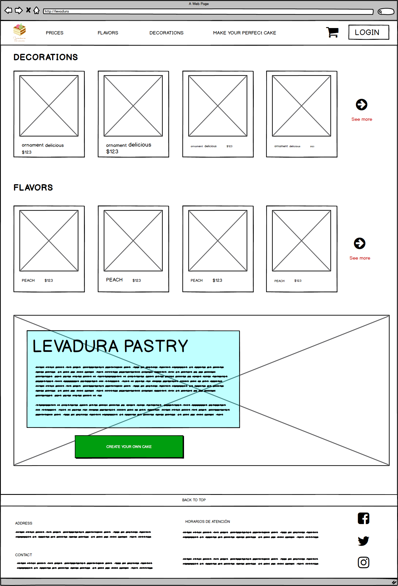
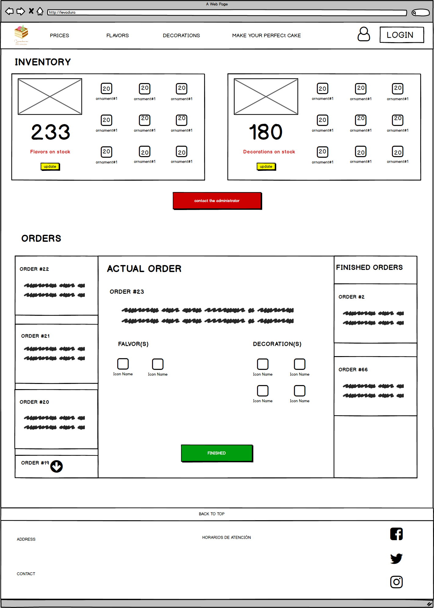

# Front end Mission HTML

:smiley: :game_die:

## Prácticas resueltas para Microsoft launch X

### Viajero: R. F. Brayan Axel

***
## Caso: Pasteleria :birthday:
---

### Levadura's Pastry

>"Pasteles sublimes para gustos finos"

#### Diagramas :cyclone:

Al hacer un pequeño análisis se crearon dos daigramas de caso de uso para entender mejor los querimientos del cliente

#### Pastry system/user

#### Pastry system/Baker

#### MockUps :sunny:

Para esta parte me apoye de la siguiente herramienta:
- Balsamic mockups (https://balsamiq.com/wireframes/)

[home o inicio](./index.html)

[Formulario para ordenar](form.html)

[Home o inicio del Pastelero](baker.html)

Finalmente se maqueto usando el editor de textos 
- VSCODE (https://code.visualstudio.com/)
***
Redes sociales: 
* GitHub: [Axl Reyes](https://github.com/axlgoze)
* Instagram: [axlze](https://www.instagram.com/axlze/)

